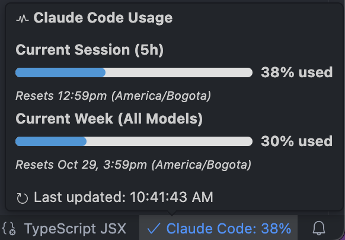

# Claude Code Usage Monitor

A VS Code, Cursor, Windsurf extension that monitors your Claude Code CLI usage directly in the status bar.

## Features

- **Status Bar Integration**: Shows current session usage percentage in the VS Code status bar
- **Detailed Tooltips**: Hover over the status bar item to see detailed usage information including:
  - Current session (5-hour) usage with progress bar
  - Current week (all models) usage with progress bar
  - Current week (Opus) usage (if available)
  - Reset times and timestamps
- **Auto-refresh**: Configurable automatic refresh intervals
- **Manual Fetch**: Click the status bar item or use the command to fetch usage data manually
- **Startup Fetch**: Option to fetch usage data when VS Code starts

## Requirements

- Claude Code CLI installed and authenticated (`claude login`)
- tmux installed (for headless CLI interaction)
- Node.js and npm

## Installation

1. Clone or download this extension
2. Run `npm install` in the extension directory
3. Run `npm run compile` to build the extension
5. Install the extension in VS Code:
   - Open VS Code
   - Press `Ctrl+Shift+P` (or `Cmd+Shift+P` on Mac)
   - Type "Extensions: Install from VSIX"
   - Select the compiled `.vsix` file

## Configuration

The extension provides the following configuration options (accessible via VS Code Settings):

- `claudeCodeUsage.fetchOnStartup`: Automatically fetch usage data when VS Code starts (default: true)
- `claudeCodeUsage.autoRefreshMinutes`: Auto-refresh interval in minutes (default: 5, set to 0 to disable)

## Usage

1. Ensure Claude Code CLI is installed and you're logged in (`claude login`)
2. The extension will automatically start monitoring usage
3. Click the status bar item or use the "Claude Code: Fetch Usage Now" command to manually refresh
4. Hover over the status bar item to see detailed usage information

## How it Works

This extension uses the provided `claude_usage_capture.sh` script to interact with the Claude Code CLI in a headless tmux session. The script was obtained from [jazzyalex/agent-sessions](https://github.com/jazzyalex/agent-sessions) repository, all credits for this script go to jazzyalex (Alexander Malakhov). The script:

1. Launches Claude Code in a detached tmux session
2. Waits for the TUI to boot
3. Sends the `/usage` command
4. Captures and parses the usage information
5. Returns the data as JSON

The extension then displays this information in the VS Code status bar with appropriate icons and colors based on usage levels.

### Error Handling

The extension provides helpful error messages for common scenarios:

- **⚠️ Init Required**: Workspace needs to be initialized with Claude Code
- **🔑 Auth Required**: Need to run `claude login`
- **⚠️ CLI Not Found**: Claude Code CLI not installed
- **⚠️ tmux Not Found**: tmux package not installed

## License

MIT

**Note**: This is an unofficial extension and is not affiliated with Anthropic or Claude.ai.